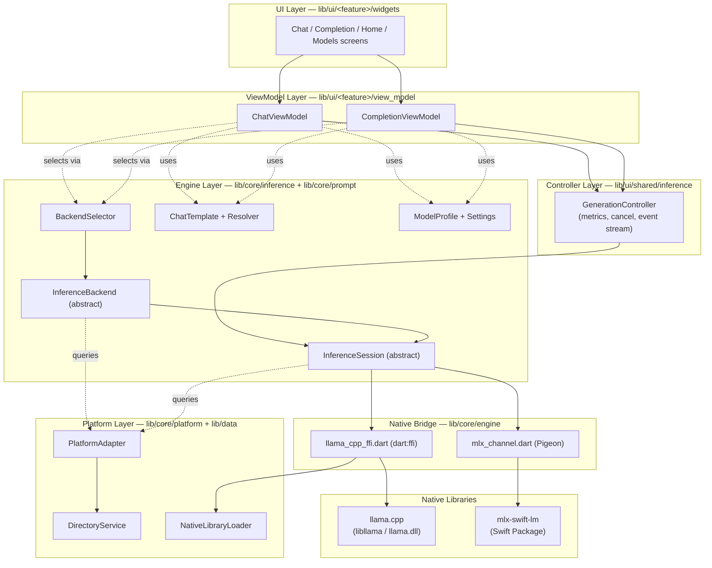
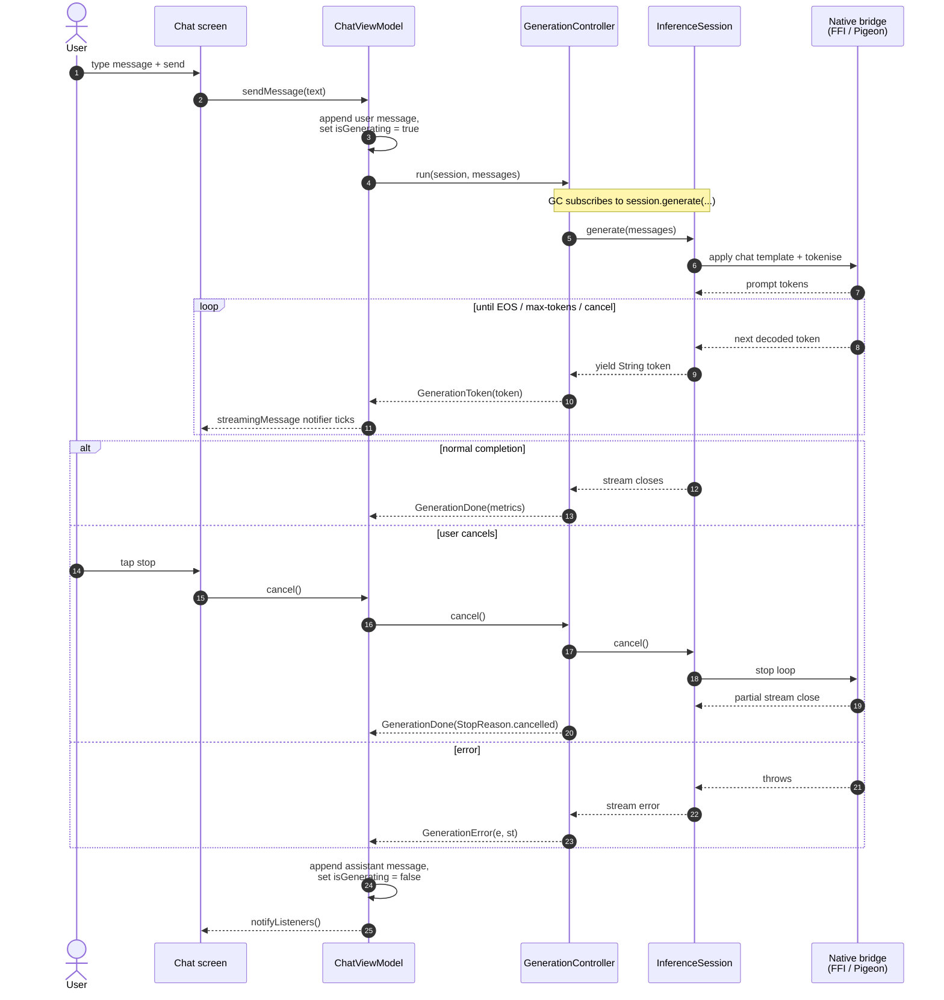

# Architecture Overview

> Audience: maintainers and new contributors.
> This document is **not** a user guide; it describes how `little_star_app`
> is structured internally and how its layers fit together.

## 1. Purpose & Audience

`little_star_app` is a Flutter app that runs Large Language Models on-device,
backed by two native inference libraries:

- **llama.cpp** (C/C++) — for GGUF-format models on all supported platforms.
- **MLX** (Swift) — for MLX-format models on Apple Silicon, via the
  `mlx-swift-lm` package.

This document explains the layered structure that lets these two backends
coexist behind a single, testable Dart abstraction. Read this first if you
need to:

- Add a new inference backend (e.g. Core ML, ONNX Runtime).
- Add a new chat-template family.
- Bring up a new target platform.
- Trace where a bug between the UI and the native layer lives.

For the *why* behind specific design choices, see the [ADRs](../adr/README.md).

## 2. High-Level Architecture



The diagram is read top-down: UI delegates to a ViewModel; the ViewModel
asks a `GenerationController` to run a turn; the controller drives an
`InferenceSession` produced by a `Backend`; the session calls a native
bridge; the bridge calls the underlying library.

## 3. Layered Model

The codebase is organised into six layers with strict downward dependencies —
upper layers may import from lower layers, never the reverse.

### 3.1 UI Layer — `lib/ui/<feature>/widgets/`

Pure Flutter widgets. They render state from a ViewModel and forward user
input back to it. No business logic, no direct calls to the engine layer.

| Feature | Entry widget |
|---------|--------------|
| Home (model picker) | `lib/ui/home/widgets/home_screen.dart` |
| Chat | `lib/ui/chat/widgets/chat_screen.dart` |
| Completion (single-turn) | `lib/ui/completion/widgets/completion_screen.dart` |
| Models (download, browse) | `lib/ui/models/widgets/model_manager_screen.dart` |
| About | `lib/ui/about/about_screen.dart` |

### 3.2 ViewModel Layer — `lib/ui/<feature>/view_model/`

`ChangeNotifier` subclasses that hold UI state (messages list, generating
flag, error text, downloaded-model list) and orchestrate session lifecycle.
ViewModels own an `InferenceSession` across the lifetime of one model
selection — sessions are reused across turns and recreated only when the
model or settings change.

| ViewModel | File | Lines |
|-----------|------|-------|
| `ChatViewModel` | `lib/ui/chat/view_model/chat_viewmodel.dart` | 277 |
| `CompletionViewModel` | `lib/ui/completion/view_model/completion_viewmodel.dart` | 244 |
| `HomeViewModel` | `lib/ui/home/view_model/home_viewmodel.dart` | — |
| `ModelManagerViewModel` | `lib/ui/models/view_model/model_manager_viewmodel.dart` | — |

ViewModels do **not** drive the generation loop themselves — that
responsibility moved to `GenerationController` in v0.1. See ADR-0005.

### 3.3 Controller Layer — `lib/ui/shared/inference/`

A single class, `GenerationController`, owns generation orchestration:

- Drives the `InferenceSession.generate` stream.
- Measures TTFT and TPS, derives `StopReason`.
- Emits `Stream<GenerationEvent>` (`GenerationToken` → `GenerationDone` |
  `GenerationError`).
- Supports cooperative cancel via `cancel()`.

`GenerationController` has no Flutter or Riverpod dependency and is
unit-tested in isolation. See ADR-0005 for the boundary rationale.

### 3.4 Engine Layer — `lib/core/inference/` + `lib/core/prompt/`

The backend-agnostic core of the app. Two abstract contracts let any
inference library plug in without the upper layers knowing which one
is running.

```
InferenceBackend ─── canHandle(profile) → bool
                 └── createSession(profile, settings) → InferenceSession

InferenceSession ─── generate(messages) → Stream<String>
                 ├── cancel()
                 └── dispose()
```

| File | Role |
|------|------|
| `inference_backend.dart` | `InferenceBackend` abstract class |
| `inference_session.dart` | `InferenceSession` abstract class |
| `inference_settings.dart` | `InferenceSettings` value object (sampler, system prompt, max tokens, stop sequences) |
| `sampling_params.dart` | `SamplingParams` (top-k, top-p, temperature) |
| `backend_selector.dart` | `BackendSelector` — picks the right backend at runtime |
| `llama_cpp_backend.dart` | `LlamaCppBackend` + `LlamaCppSession` + testable `LlamaFfiDriver` |

The prompt sub-package handles model-family-specific chat templating
(see ADR-0004):

| File | Role |
|------|------|
| `prompt/chat_template.dart` | `ChatTemplate` abstract class + Gemma/Llama3/ChatML/Fallback implementations |
| `prompt/chat_template_resolver.dart` | Picks a template from `ModelProfile.chatTemplateHint`; exposes `chatTemplateProvider` (Riverpod) |

Model metadata lives in `lib/core/model/`:

| File | Role |
|------|------|
| `model/model_profile.dart` | `ModelProfile` + `ModelFormat` + `ChatTemplateHint` + `BackendHint` |

### 3.5 Native Bridge Layer — `lib/core/engine/`

Two parallel bridges, kept separate by design (see ADR-0002):

| Bridge | Files | Used by |
|--------|-------|---------|
| FFI (llama.cpp) | `engine/llama_cpp/llama_cpp_ffi.dart` | `LlamaCppSession` |
| Pigeon (MLX) | `engine/mlx/mlx_channel.dart`, `engine/mlx/mlx_inference.g.dart` | `MlxSession` (task-1001) |

The FFI bridge calls C functions directly; the Pigeon bridge crosses into
Swift via a generated type-safe channel. See ADR-0003 for the streaming
pattern that lets Pigeon deliver tokens as a Dart `Stream`.

### 3.6 Platform Layer — `lib/core/platform/` + `lib/data/services/directory_service.dart`

Encapsulates everything the engine cannot assume across platforms:

| File | Role |
|------|------|
| `core/platform/platform_adapter.dart` | `PlatformAdapter` — `platformId`, `supportsInference`, `directoryService` |
| `core/platform/native_library_loader.dart` | Locates and `dlopen`s the right llama.cpp dynamic library per platform |
| `data/services/directory_service.dart` | Per-platform model-storage directories, file enumeration, permission checks |

Platform support matrix (see `PlatformAdapter` implementations):

| Platform | `supportsInference` | llama.cpp | MLX |
|----------|---------------------|-----------|-----|
| iOS | true | ✅ static lib | ✅ SPM (mlx-swift-lm) |
| macOS | true | ✅ via NativeLibraryLoader | — |
| Android | true | ✅ static lib | — |
| Windows | false* | ✅ DLL (b9334) | — |
| Linux | false | — | — |

\*Windows llama.cpp build landed in EP-8 task-801; `supportsInference` will
flip true once the desktop integration tasks in EP-1 close out.

## 4. Data Flow Walkthrough

The diagram below traces one chat turn end to end. The same flow applies
to single-turn completion; only the ViewModel changes.



Three things to notice:

1. **Token push, not pull.** Tokens flow upward through `Stream` /
   `yield` — neither the ViewModel nor the controller polls. The native
   side decides when the next token is ready.
2. **Three terminal paths.** Every `run()` ends with exactly one of
   `GenerationDone(completed)`, `GenerationDone(cancelled)`, or
   `GenerationError`. The stream is never left dangling.
3. **Cancellation is cooperative.** `cancel()` requests a stop; the
   native loop checks at the next iteration. Cleanup (notifyListeners,
   isGenerating reset) runs after the controller emits `GenerationDone`.

## 5. Module Reference

A flat index of every directory under `lib/` and its purpose.

| Module | Purpose | Key entry point |
|--------|---------|-----------------|
| `lib/main.dart` | App entry; Riverpod ProviderScope; Hive init; Firebase init (mobile only) | `main()` |
| `lib/config/` | Recommended-model catalogue (curated list shown on home) | `recommended_models.dart` |
| `lib/core/inference/` | Backend abstraction, session contract, selector | `inference_backend.dart` |
| `lib/core/prompt/` | Chat template family + resolver | `chat_template.dart` |
| `lib/core/model/` | Model metadata: profile, format, template hint | `model_profile.dart` |
| `lib/core/engine/llama_cpp/` | Raw FFI bindings to llama.cpp | `llama_cpp_ffi.dart` |
| `lib/core/engine/mlx/` | Pigeon channel + generated glue for MLX | `mlx_channel.dart` |
| `lib/core/platform/` | Platform adapter + native lib loader | `platform_adapter.dart` |
| `lib/data/repositories/` | Persistence: Hive (`DownloadRepository`), filesystem scan (`GGUFRepository`) | `download_repository.dart` |
| `lib/data/services/` | I/O services: directory, download (Dio), HuggingFace API, logs, crash reporting, onboarding, app info | `directory_service.dart`, `download_service.dart` |
| `lib/providers/` | Riverpod `Provider` declarations wiring services / repositories | `service_providers.dart` |
| `lib/models/` | Plain-data classes: `ChatMessage`, `DownloadTask`, `GGUFModelInfo`, `HFModelInfo` | `chat_message.dart` |
| `lib/ui/shared/inference/` | `GenerationController` + event hierarchy | `generation_controller.dart` |
| `lib/ui/shared/widgets/` | Cross-feature widgets (log export dialog, etc.) | — |
| `lib/ui/<feature>/view_model/` | Feature ViewModels | `chat_viewmodel.dart`, etc. |
| `lib/ui/<feature>/widgets/` | Feature screens and component widgets | `chat_screen.dart`, etc. |
| `lib/debug/` | Dev-only screens (e.g. MLX spike) | `mlx_spike_screen.dart` |
| `lib/utils/` | Logger | `logger.dart` |

## 6. Cross-Cutting Concerns

### 6.1 Dependency Injection — Riverpod

All shared services and repositories are exposed as Riverpod `Provider`s
in `lib/providers/service_providers.dart`. Feature ViewModels read these
providers via `Ref`; they do not instantiate services directly. Examples:

```dart
final directoryServiceProvider   = Provider<DirectoryService>(...);
final huggingFaceServiceProvider = Provider<HuggingFaceService>(...);
final downloadServiceProvider    = Provider<DownloadService>(...);
final backendSelectorProvider    = Provider<BackendSelector>(...);
final chatTemplateProvider       = Provider.family<ChatTemplate, ModelProfile>(...);
```

Riverpod was adopted in v0.1 (EP-1 of the major-refactor cycle). It is not
formalised in an ADR because there was no meaningful trade-off — it is the
mainstream Flutter DI / state-management choice and the project does not
have constraints that would have favoured `provider`, `get_it`, BLoC, etc.

### 6.2 Cancellation

Cancellation is **cooperative** at every layer:

- `ViewModel.cancel()` → `GenerationController.cancel()` → `InferenceSession.cancel()`.
- The native loop checks a cancel flag (FFI side) or `Task.isCancelled`
  (Pigeon / Swift side) at each iteration and breaks.
- The stream then closes normally; the controller emits
  `GenerationDone(StopReason.cancelled)`.

No layer force-aborts. This guarantees deterministic cleanup of native
resources (sampler state, KV cache) and avoids partial writes to the
UI state.

### 6.3 Error Handling

Errors are caught at the layer that can reason about them and re-emitted
as a typed event:

- **Native bridge** errors (FFI return codes, Pigeon `PlatformException`)
  are caught by the session implementation and re-thrown as
  `Exception`s on the `Stream`.
- **Session** errors propagate as stream errors into
  `GenerationController`, which converts them to `GenerationError(e, st)`
  events.
- **ViewModel** treats `GenerationError` as an end-of-turn signal:
  records the error text in state, marks `isGenerating = false`,
  calls `notifyListeners()`. No exceptions escape to the widget tree.

### 6.4 Metrics

`GenerationController` collects three timing metrics for every run:

| Metric | Definition |
|--------|------------|
| TTFT | Time from `run()` call to the first emitted token |
| TPS | Decode phase tokens ÷ decode phase seconds |
| `stopReason` | `completed` / `cancelled` / `error` |

These are surfaced via `GenerationDone(GenerationMetrics)`, the terminal
event of a successful run. ViewModels map them into UI-specific shapes
(`MetricsData` in completion, `MessageMetrics` in chat).

The Pigeon path additionally surfaces a live `tokensPerSecond` value
with every `MlxTokenEvent`; this is currently passed through to the UI
without going via `GenerationMetrics`.

### 6.5 Model Lifecycle

A model goes through five distinct states, owned by different layers:

```
recommended → downloading → downloaded → loaded (session) → disposed
   config         data           data         engine            engine
```

| State | Layer | Where |
|-------|-------|-------|
| Recommended | Config | `lib/config/recommended_models.dart` |
| Downloading | Data | `DownloadService` + `DownloadRepository` (Hive) |
| Downloaded | Data | filesystem scan via `GGUFRepository` + `DirectoryService` |
| Loaded | Engine | `InferenceSession` (one per model selection) |
| Disposed | Engine | `InferenceSession.dispose()` releases native memory |

ViewModels recreate the session when the user changes model or settings;
the previous session is disposed first.

## 7. Extension Points

Three changes are designed to be additive (no edits to existing call sites).

### 7.1 Add a new inference backend

1. Implement `InferenceBackend` and `InferenceSession` in `lib/core/inference/`.
2. Decide a native bridge: if the library has a C API → reuse the FFI
   pattern (see `LlamaCppBackend`); if it is Swift / Objective-C → add
   a Pigeon channel under `lib/core/engine/<name>/`.
3. Register the backend in `BackendSelector` — either via a new
   `ModelFormat` enum value or as a `BackendOverride`.
4. Add unit tests with a stub `Session` (the existing `LlamaFfiDriver`
   pattern is a good template).

No ViewModel or UI changes are needed.

### 7.2 Add a new chat-template family

1. Add a new `ChatTemplateHint` variant in `lib/core/model/model_profile.dart`.
2. Implement `ChatTemplate` in `lib/core/prompt/chat_template.dart`.
3. Add a branch in `ChatTemplateResolver.resolve`.
4. Add per-template unit tests covering system-prompt placement, role
   tokens, and the trailing assistant-opening token.

See ADR-0004 for the abstraction's design and the Smoking Gun that
motivated it.

### 7.3 Add a new target platform

1. Add a `<NewPlatform>PlatformAdapter` in `lib/core/platform/platform_adapter.dart`
   and wire it in `PlatformAdapterFactory.create()`.
2. Add a `<NewPlatform>DirectoryService` in `lib/data/services/directory_service.dart`.
3. Extend `NativeLibraryLoader` with the platform-specific dynamic-library
   path resolution.
4. Build llama.cpp for the platform and bundle the resulting library.

If on-device inference is not yet supported, set
`supportsInference = false` and the engine layer will refuse to load
models on that platform.

## 8. References

- [ADR-0001: MLX integration via Path A](../adr/0001-mlx-integration-path-a.md) — why Pigeon for MLX.
- [ADR-0002: Dual native bridge](../adr/0002-dual-native-bridge.md) — why FFI and Pigeon coexist.
- [ADR-0003: Pigeon streaming pattern](../adr/0003-pigeon-streaming-pattern.md) — how tokens stream from Swift to Dart.
- [ADR-0004: ChatTemplate abstraction](../adr/0004-chat-template-abstraction.md) — replacing the old `PromptFormat`.
- [ADR-0005: GenerationController / ViewModel boundary](../adr/0005-generation-controller-boundary.md) — splitting orchestration from UI state.
- `.dev/cycles/2026-05-21-v0.1-major-refactor/` — the refactor cycle that produced this architecture.
