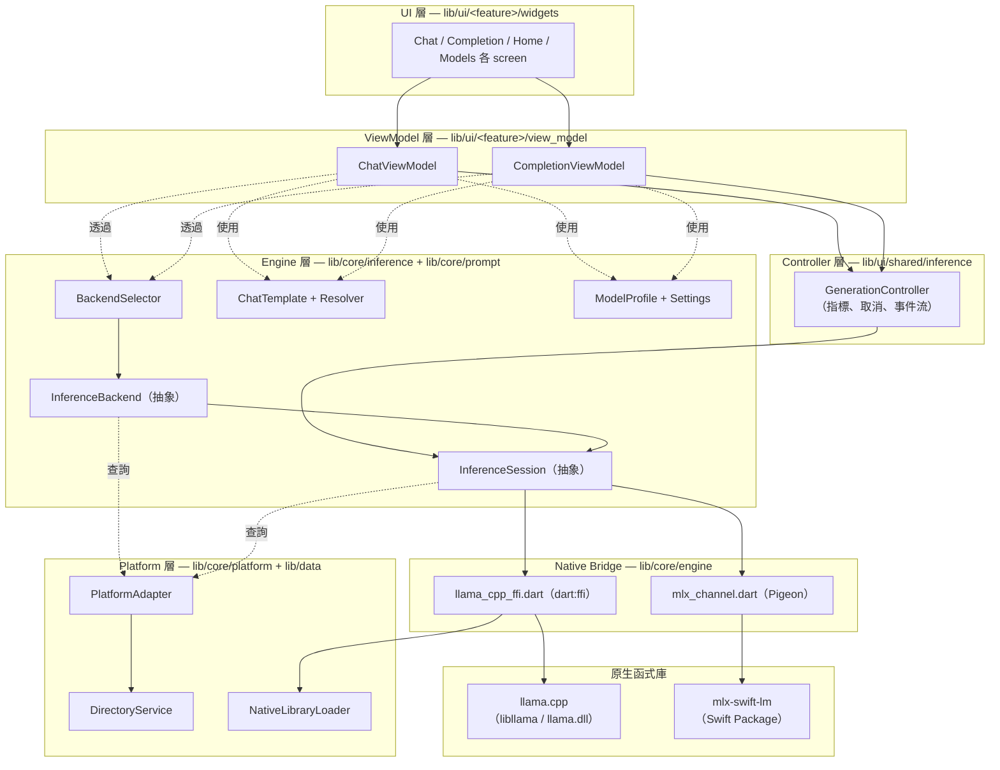
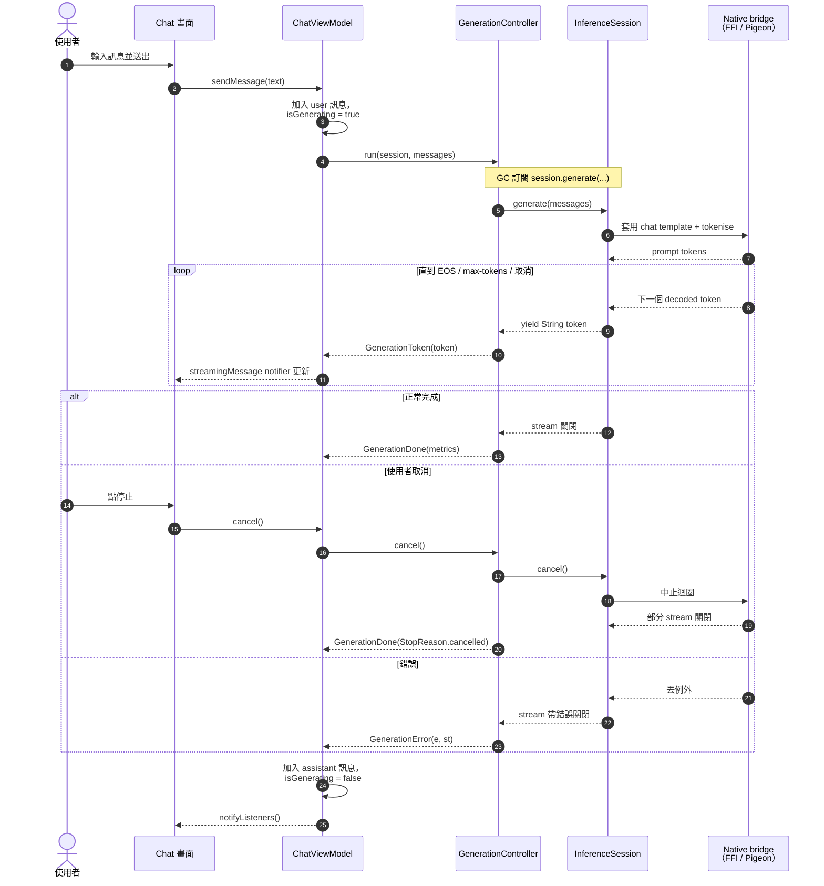

# 架構總覽（Architecture Overview）

> 讀者：維護者與新貢獻者。
> 本文**不是**使用者指南；它說明 `little_star_app` 的內部結構，以及各層之間如何協作。

> 本文為 [overview.md](./overview.md) 的正體中文版。
> 如兩版有出入，以英文版為準。

## 1. 目的與讀者

`little_star_app` 是一個在裝置端執行 LLM 的 Flutter App，背後依賴兩條原生推論函式庫：

- **llama.cpp**（C/C++）— 在所有支援平台上跑 GGUF 格式模型。
- **MLX**（Swift）— 在 Apple Silicon 上跑 MLX 格式模型，透過 `mlx-swift-lm` package。

本文說明這個分層結構如何讓兩條後端在一個可測試的 Dart 抽象之下共存。如果你要做以下任何一件事，請先讀本文：

- 加入新的推論後端（例如 Core ML、ONNX Runtime）。
- 加入新的 chat template 家族。
- 啟用新的目標平台。
- 追蹤 UI 與 native 層之間某個 bug 的歸屬層級。

關於各項設計選擇背後的「為何」，請見 [ADR 索引](../adr/README.md)。

## 2. 高階架構



圖由上往下讀：UI 委派給 ViewModel；ViewModel 請 `GenerationController` 跑一輪生成；controller 驅動 `Backend` 產出的 `InferenceSession`；session 呼叫 native bridge；bridge 呼叫底層函式庫。

## 3. 分層模型

程式碼以六層組織，依賴方向嚴格向下——上層可 import 下層，反之絕不可以。

### 3.1 UI 層 — `lib/ui/<feature>/widgets/`

僅處理 presentation 的 Flutter widget。它們渲染 ViewModel 狀態並轉送使用者輸入；可以負責 navigation 與系統 share sheet 等 presentation plugin，但不包含 domain／filesystem policy，也不直接呼叫 engine 層。

| 功能 | 入口 widget |
|------|-------------|
| Home（模型選擇） | `lib/ui/home/widgets/home_screen.dart` |
| Chat | `lib/ui/chat/widgets/chat_screen.dart` |
| Completion（單輪） | `lib/ui/completion/widgets/completion_screen.dart` |
| Models（下載、瀏覽） | `lib/ui/models/widgets/model_manager_screen.dart` |
| About | `lib/ui/about/about_screen.dart` |

### 3.2 ViewModel 層 — `lib/ui/<feature>/view_model/`

`ChangeNotifier` 的子類，持有 UI 狀態（訊息列表、生成中 flag、錯誤文字、已下載模型清單）並編排 session 生命週期。ViewModel 在使用者選擇單一模型期間持有 `InferenceSession`——session 在多輪對話間重用，只有當模型或設定改變時才重建。

`ChatViewModel` 與 `CompletionViewModel` 刻意各自保留 session 開啟實作，因為 dirty-state 與重用時機屬於各自 owner。共用的本機路徑 metadata 規則集中在 `ModelProfile.fromLocalPath`；若再抽 session ownership，只會在 `BackendSelector` 上增加 pass-through Module。

| ViewModel | 檔案 | 行數 |
|-----------|------|------|
| `ChatViewModel` | `lib/ui/chat/view_model/chat_viewmodel.dart` | 277 |
| `CompletionViewModel` | `lib/ui/completion/view_model/completion_viewmodel.dart` | 244 |
| `HomeViewModel` | `lib/ui/home/view_model/home_viewmodel.dart` | — |
| `ModelManagerViewModel` | `lib/ui/models/view_model/model_manager_viewmodel.dart` | — |
| `MlxModelViewModel` | `lib/ui/models/view_model/mlx_model_viewmodel.dart` | — |
| `BenchmarkViewModel` | `lib/ui/benchmark/view_model/benchmark_viewmodel.dart` | — |

ViewModel **不再**自己驅動生成迴圈——這個職責在 v0.1 移到 `GenerationController`。見 ADR-0005。

### 3.3 Controller 層 — `lib/ui/shared/inference/` + `lib/ui/<feature>/controller/`

唯一的類別 `GenerationController` 負責生成編排：

- 驅動 `InferenceSession.generate` 的串流。
- 計算 TTFT 和 TPS，產出 `StopReason`。
- 發出 `Stream<GenerationEvent>`（`GenerationToken` → `GenerationDone` | `GenerationError`）。
- 透過 `cancel()` 支援協同式取消。

`GenerationController` 沒有 Flutter 也沒有 Riverpod 依賴，可獨立單元測試。邊界劃分的理由見 ADR-0005。

`BenchmarkRecorder` 位於 `lib/ui/benchmark/controller/`，把 generation controller
與 telemetry probes 組合起來，回傳 core 擁有的 `BenchmarkSample`。Protocol 與
sustained-run 的順序、preflight 狀態與 consume-once app-cold 選項都由
`BenchmarkViewModel` 負責；widget 只渲染狀態、轉送輸入，並透過系統 share sheet 呈現已匯出的檔案。

### 3.4 Engine 層 — `lib/core/inference/` + `lib/core/prompt/`

App 中與後端無關的核心。兩個抽象合約讓任何推論函式庫接上，上層完全不需要知道目前在跑哪一條。

```
InferenceBackend ─── canHandle(profile) → bool
                 └── createSession(profile, settings) → InferenceSession

InferenceSession ─── generate(messages) → Stream<String>
                 ├── cancel()
                 └── dispose()
```

| 檔案 | 職責 |
|------|------|
| `inference_backend.dart` | `InferenceBackend` 抽象類別 |
| `inference_session.dart` | `InferenceSession` 抽象類別 |
| `generation_metrics.dart` | controller 與 benchmark record 共用的 `GenerationMetrics` + `StopReason` value types |
| `inference_settings.dart` | `InferenceSettings` value object（sampler、system prompt、max tokens、stop sequences） |
| `sampling_params.dart` | `SamplingParams`（top-k、top-p、temperature） |
| `backend_selector.dart` | `BackendSelector` — 執行期選取對應後端 |
| `llama_cpp_backend.dart` | `LlamaCppBackend` + `LlamaCppSession` + 可測試的 `LlamaFfiDriver` |
| `turn_marker_filter.dart` | 共用 marker matching 規則；各 backend 刻意保留自己的 stream lifecycle，因為 native event 與 completion 語意不同 |

`prompt/` 子套件處理模型家族專屬的 chat template（見 ADR-0004）：

| 檔案 | 職責 |
|------|------|
| `prompt/chat_template.dart` | `ChatTemplate` 抽象 + Gemma/Llama3/ChatML/Fallback 實作 |
| `prompt/chat_template_resolver.dart` | 從 `ModelProfile.chatTemplateHint` 選取模板；暴露 `chatTemplateProvider`（Riverpod） |

模型 metadata 在 `lib/core/model/`：

| 檔案 | 職責 |
|------|------|
| `model/model_profile.dart` | `ModelProfile` + `ModelFormat` + 共用的本機路徑 profile／format 判斷規則 |

### 3.5 Native Bridge 層 — `lib/core/engine/`

刻意保持兩條平行 bridge（見 ADR-0002）：

| Bridge | 檔案 | 使用方 |
|--------|------|--------|
| FFI（llama.cpp） | `engine/llama_cpp/llama_cpp_ffi.dart` | `LlamaCppSession` |
| Pigeon（MLX） | `engine/mlx/mlx_channel.dart`、`engine/mlx/mlx_inference.g.dart` | `MlxSession`（task-1001） |

FFI bridge 直接呼叫 C 函式；Pigeon bridge 透過產生的型別安全 channel 跨進 Swift。Pigeon 如何把 token 送進 Dart `Stream` 的細節見 ADR-0003。

### 3.6 Platform 層 — `lib/core/platform/` + `lib/data/services/directory_service.dart`

封裝 engine 層無法跨平台假設的所有事情：

| 檔案 | 職責 |
|------|------|
| `core/platform/platform_adapter.dart` | `PlatformAdapter` — `platformId`、`supportsInference`、`supportsMlx`、`directoryService` |
| `core/platform/native_library_loader.dart` | 每平台找出正確的 llama.cpp 動態函式庫並 `dlopen` |
| `data/services/directory_service.dart` | 每平台的模型儲存目錄、檔案列舉、權限請求 |

平台支援矩陣（見各 `PlatformAdapter` 實作）：

| 平台 | `supportsInference` | llama.cpp | MLX |
|------|---------------------|-----------|-----|
| iOS | true | ✅ static lib | ✅ SPM（mlx-swift-lm） |
| macOS | true | ✅ 經 NativeLibraryLoader | ✅ 僅 Apple Silicon |
| Android | true | ✅ static lib | — |
| Windows | false* | ✅ DLL（b9334） | — |
| Linux | false | — | — |

\*Windows llama.cpp build 已在 EP-8 task-801 落地；待 EP-1 desktop 整合任務收尾後，`supportsInference` 才會切到 true。

## 4. 資料流（Data Flow）

下圖追蹤一個完整的 chat turn。Completion 的單輪生成適用同一個流程，差別只在 ViewModel。



三個重點：

1. **Token 是推上來的，不是 ViewModel 拉的。** Token 由下而上透過 `Stream` / `yield` 流動——ViewModel 與 controller 都不輪詢。Native 端決定下一個 token 何時準備好。
2. **三個終點。** 每次 `run()` 都恰好以 `GenerationDone(completed)`、`GenerationDone(cancelled)`、`GenerationError` 三者其一結束。Stream 不會處於懸置狀態。
3. **取消是協同式。** `cancel()` 只是發出停止請求；native 迴圈在下一次迭代檢查並 break。清理（`notifyListeners`、`isGenerating` 重置）在 controller 發出 `GenerationDone` 之後執行。

## 5. 模組索引（Module Reference）

`lib/` 底下每個目錄及其用途的扁平索引。

| 模組 | 用途 | 主要入口 |
|------|------|----------|
| `lib/main.dart` | App 入口；Riverpod ProviderScope；Hive 初始化；Firebase 初始化（行動裝置限定） | `main()` |
| `lib/config/` | 推薦模型目錄（home 顯示的 curated 清單） | `recommended_models.dart` |
| `lib/core/inference/` | 後端抽象、session 合約、selector | `inference_backend.dart` |
| `lib/core/prompt/` | Chat template 家族 + resolver | `chat_template.dart` |
| `lib/core/model/` | 模型 metadata：profile、format、template hint | `model_profile.dart` |
| `lib/core/engine/llama_cpp/` | llama.cpp 原始 FFI binding | `llama_cpp_ffi.dart` |
| `lib/core/engine/mlx/` | MLX Pigeon channel + 產生 glue | `mlx_channel.dart` |
| `lib/core/platform/` | Platform adapter + 原生函式庫 loader | `platform_adapter.dart` |
| `lib/data/repositories/` | 永續化：Hive（`DownloadRepository`）、檔案系統掃描（`GGUFRepository`） | `download_repository.dart` |
| `lib/data/services/` | I/O 服務：目錄、下載（Dio）、HuggingFace API、日誌、Crash 回報、新手導引、App info | `directory_service.dart`、`download_service.dart` |
| `lib/providers/` | Riverpod `Provider` 宣告，串接 service / repository | `service_providers.dart` |
| `lib/models/` | 純資料類別：`ChatMessage`、`DownloadTask`、`GGUFModelInfo`、`HFModelInfo` | `chat_message.dart` |
| `lib/ui/shared/inference/` | `GenerationController` + 事件階層 | `generation_controller.dart` |
| `lib/ui/shared/widgets/` | 跨功能 widget（log 匯出對話框等） | — |
| `lib/ui/<feature>/view_model/` | 功能專屬 ViewModel | `chat_viewmodel.dart` 等 |
| `lib/ui/<feature>/widgets/` | 功能畫面與元件 widget | `chat_screen.dart` 等 |
| `lib/debug/` | 開發專用畫面（例如 MLX spike） | `mlx_spike_screen.dart` |
| `lib/utils/` | Logger | `logger.dart` |

## 6. 橫切關注點（Cross-Cutting Concerns）

### 6.1 依賴注入 — Riverpod

所有共享 service 與 repository 都在 `lib/providers/service_providers.dart` 以 Riverpod `Provider` 形式暴露。功能 ViewModel 透過 `Ref` 讀取這些 provider，不直接實例化 service。範例：

```dart
final directoryServiceProvider   = Provider<DirectoryService>(...);
final huggingFaceServiceProvider = Provider<HuggingFaceService>(...);
final downloadServiceProvider    = Provider<DownloadService>(...);
final backendSelectorProvider    = Provider<BackendSelector>(...);
final chatTemplateProvider       = Provider.family<ChatTemplate, ModelProfile>(...);
```

Riverpod 在 v0.1 全面導入（major-refactor 循環 EP-1）。沒有為它寫獨立 ADR，因為這個選擇沒有真正的取捨——它是目前 Flutter DI / 狀態管理的主流選擇，本專案也沒有偏向 `provider`、`get_it`、BLoC 的特殊限制。

### 6.2 取消（Cancellation）

每一層的取消都是**協同式**：

- `ViewModel.cancel()` → `GenerationController.cancel()` → `InferenceSession.cancel()`。
- Native 迴圈在每次迭代檢查 cancel flag（FFI 端）或 `Task.isCancelled`（Pigeon / Swift 端）並 break。
- Stream 接著正常關閉；controller 發出 `GenerationDone(StopReason.cancelled)`。

沒有任何一層強制中止。這保證原生資源（sampler 狀態、KV cache）能被確定性清理，也避免 UI 狀態出現部分寫入。

### 6.3 錯誤處理

錯誤在能合理推理它的那一層被捕捉，並以型別化事件重新發出：

- **Native bridge** 的錯誤（FFI return code、Pigeon `PlatformException`）由 session 實作捕捉，並以 `Exception` 重新丟到 `Stream` 上。
- **Session** 的錯誤以 stream error 形式傳到 `GenerationController`，後者轉成 `GenerationError(e, st)` event。
- **ViewModel** 把 `GenerationError` 視為 turn 結束訊號：將錯誤文字記錄到狀態、把 `isGenerating` 設為 false、呼叫 `notifyListeners()`。沒有 exception 會逃到 widget tree。

### 6.4 指標（Metrics）

`GenerationController` 為每次 run 收集三個計時指標：

| 指標 | 定義 |
|------|------|
| TTFT | `run()` 呼叫到第一個 emit token 的時間 |
| TPS | decode 階段 token 數 ÷ decode 階段秒數 |
| `stopReason` | `completed` / `cancelled` / `error` |

這些指標透過 `GenerationDone(GenerationMetrics)` 暴露——是成功 run 的終結 event。ViewModel 將它們映射到 UI 專屬形式（completion 的 `MetricsData`、chat 的 `MessageMetrics`）。

Pigeon 路徑額外在每個 `MlxTokenEvent` 上附帶即時的 `tokensPerSecond`；目前直接透傳到 UI，沒有走 `GenerationMetrics`。

### 6.5 模型生命週期

模型會經過五個由不同層擁有的狀態：

```
recommended → downloading → downloaded → loaded (session) → disposed
   config         data           data         engine            engine
```

| 狀態 | 所屬層 | 位置 |
|------|--------|------|
| Recommended | Config | `lib/config/recommended_models.dart` |
| Downloading | Data | `DownloadService` + `DownloadRepository`（Hive） |
| Downloaded | Data | 透過 `GGUFRepository` + `DirectoryService` 掃檔 |
| Loaded | Engine | `InferenceSession`（每次選擇模型一個） |
| Disposed | Engine | `InferenceSession.dispose()` 釋放原生記憶體 |

使用者改變模型或設定時，ViewModel 重建 session；舊 session 會先被 dispose。

## 7. 擴充點（Extension Points）

三個變更被設計為**累加式**（不需要動到既有呼叫端）。

### 7.1 新增推論後端

1. 在 `lib/core/inference/` 實作 `InferenceBackend` 與 `InferenceSession`。
2. 決定 native bridge：函式庫有 C API → 沿用 FFI pattern（見 `LlamaCppBackend`）；若是 Swift / Objective-C → 在 `lib/core/engine/<name>/` 下加 Pigeon channel。
3. 在 `BackendSelector` 註冊新後端——新增 `ModelFormat` enum 變體，或以 `BackendOverride` 形式注入。
4. 加單元測試，使用 stub `Session`（既有的 `LlamaFfiDriver` pattern 是好範例）。

ViewModel 與 UI 完全不需要改。

### 7.2 新增 chat template 家族

1. 在 `lib/core/model/model_profile.dart` 加新的 `ChatTemplateHint` 變體。
2. 在 `lib/core/prompt/chat_template.dart` 實作 `ChatTemplate`。
3. 在 `ChatTemplateResolver.resolve` 加分支。
4. 加每個模板的單元測試，涵蓋系統提示放置位置、角色 token、結尾 assistant-opening token。

抽象設計與促成它的 Smoking Gun 見 ADR-0004。

### 7.3 新增目標平台

1. 在 `lib/core/platform/platform_adapter.dart` 加 `<NewPlatform>PlatformAdapter`，並在 `PlatformAdapterFactory.create()` 串接。
2. 在 `lib/data/services/directory_service.dart` 加 `<NewPlatform>DirectoryService`。
3. 擴充 `NativeLibraryLoader` 加入該平台的動態函式庫路徑解析。
4. 為該平台 build llama.cpp 並把產出函式庫 bundle 進去。

若該平台暫不支援裝置端推論，把 `supportsInference` 設為 `false`，engine 層會拒絕在該平台載入模型。

## 8. References（參考資料）

- [ADR-0001：MLX 整合走 Path A](../adr/0001-mlx-integration-path-a_zh-tw.md) — MLX 為何使用 Pigeon。
- [ADR-0002：Native bridge 雙軌策略](../adr/0002-dual-native-bridge_zh-tw.md) — FFI 與 Pigeon 為何並存。
- [ADR-0003：Pigeon streaming pattern](../adr/0003-pigeon-streaming-pattern_zh-tw.md) — token 如何從 Swift 串到 Dart。
- [ADR-0004：ChatTemplate 抽象化](../adr/0004-chat-template-abstraction_zh-tw.md) — 取代舊 `PromptFormat`。
- [ADR-0005：GenerationController / ViewModel 邊界](../adr/0005-generation-controller-boundary_zh-tw.md) — 編排與 UI 狀態分離。
- `.dev/cycles/2026-05-21-v0.1-major-refactor/` — 產出此架構的重構循環。
